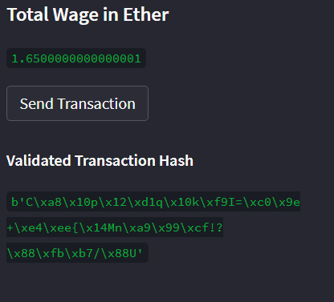

# Cryptocurrency Wallet
This prototype Streamlit application consists of a user-friendly web interface that allows customers to find fintech professionals from a list of candidates, hire them, and instantly pay them with the Ether cryptocurrency. 

## Technologies
The technologies required to use this project include: python 3.7 with streamlit, dataclasses, typing, web3, os, requests, dotenv, and bip44 . As well as Ganache. 

## Examples
**Fintech Finder Database:**

Upon running the streamlit application, the users are presented with a screen that shows the database of the available fintech professionals up for hire. The information about each fintech professional shown includes: a photo, their name, their ethereum account address, their rating, and their hourly rate per Ether. 

**Client Account & Available Candidates:**

A sidebar is displayed that shows the client's account address and ethereum balance in Ether, as well as the functionality to select a fintech professional from a dropdown list, and enter the number of hours to hire them. Upon selecting a person from the list, the candiate's name, hourly rate, and ethereum address is displayed. After entering a value in the "Number of Hours" input box, the "Total Wage in Ether" is updated with the calculated value. The client can change the selected candidate from the list while keeping the number of hours the same, in order to compare the calculated total wage. Or they can change the number of hours for a given candidate to update the calculated total wage value.

**Send Transaction:**

Next, once the client is happy with the selected candidate and the calculated total wage, she can click the "Send Transaction" button to hire the candidate, and instantly pay them with the Ether cryptocurrency by sending an authorized (signed) transaction to the Ganache blockchain. A "Validated Transaction Hash" is then shown on the sidebar below the "Send Transaction" button to confirm that the transaction was successful, communicated to Ganache, validated, and added to a block.

Following is a screenshot of the client's account (index 0) from the Ganache accounts tab. It shows the client's ethereum account address and their balance after completing the send transaction.

Lastly, the screenshot below is of the transaction details from the Ganache transactions tab. It shows the transaction hash, the client's (sender) address, the fintech professional's (to contract) address, the value in Ether that was sent to the fintech professional's address, and the block in which the transaction was mined.

